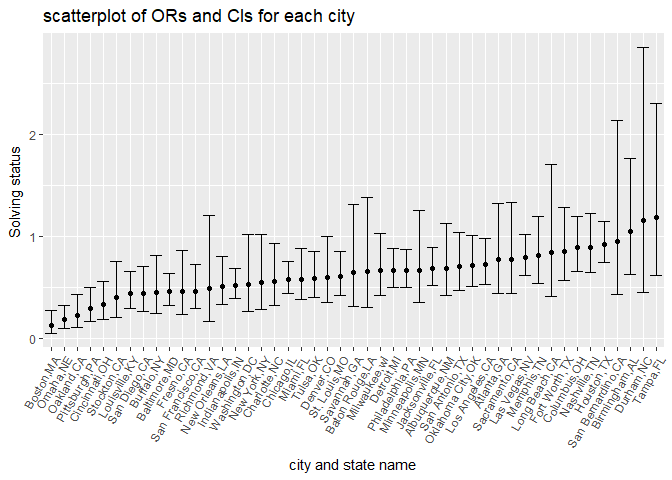

HW6
================
Chu YU
2018/11/22

Problem 1
---------

(1)The Washington Post has gathered data on homicides in 50 large U.S. cities and we will use it as our dataset.

``` r
## import the data
homicide_df = read.csv("./data/homicide-data.csv") %>%
  mutate(city_state = str_c(city,",", state),
         solving_status = 
           ifelse(disposition %in% c("Closed without arrest", "Open/No arrest"), 0, 1)) %>%
  filter(!(city_state %in% c("Dallas,TX","Phoenix,AZ","Kansas City,MO","Tulsa,AL"))) %>%
  mutate(victim_race = ifelse(victim_race == "White", "white", "non-white"),
         victim_race = factor(victim_race, levels = c("white", "non-white")),
         victim_age = as.numeric(victim_age))

str(homicide_df)
```

    ## 'data.frame':    48507 obs. of  14 variables:
    ##  $ uid           : Factor w/ 52179 levels "Alb-000001","Alb-000002",..: 1 2 3 4 5 6 7 8 9 10 ...
    ##  $ reported_date : int  20100504 20100216 20100601 20100101 20100102 20100126 20100127 20100127 20100130 20100210 ...
    ##  $ victim_last   : Factor w/ 12687 levels "AARON","AAZRI",..: 4304 8036 10274 7767 8165 1344 7075 7075 7232 5285 ...
    ##  $ victim_first  : Factor w/ 16640 levels "A'QUALE","A.C.",..: 8298 1977 16092 2068 16090 5950 3563 2758 6177 6647 ...
    ##  $ victim_race   : Factor w/ 2 levels "white","non-white": 2 2 1 2 1 1 2 2 1 2 ...
    ##  $ victim_age    : num  79 12 10 29 73 94 51 51 55 41 ...
    ##  $ victim_sex    : Factor w/ 3 levels "Female","Male",..: 2 2 1 2 1 1 2 1 2 2 ...
    ##  $ city          : Factor w/ 50 levels "Albuquerque",..: 1 1 1 1 1 1 1 1 1 1 ...
    ##  $ state         : Factor w/ 28 levels "AL","AZ","CA",..: 19 19 19 19 19 19 19 19 19 19 ...
    ##  $ lat           : num  35.1 35.1 35.1 35.1 35.1 ...
    ##  $ lon           : num  -107 -107 -107 -107 -107 ...
    ##  $ disposition   : Factor w/ 3 levels "Closed by arrest",..: 2 1 2 1 2 3 1 1 3 3 ...
    ##  $ city_state    : chr  "Albuquerque,NM" "Albuquerque,NM" "Albuquerque,NM" "Albuquerque,NM" ...
    ##  $ solving_status: num  0 1 0 1 0 0 1 1 0 0 ...

(2)linear regression model For the city of Baltimore, MD

``` r
homicide_fit_logistic = homicide_df %>%
  filter(city_state == "Baltimore,MD") %>% 
  glm(solving_status ~ victim_age + victim_race + victim_sex, 
      family = binomial(), data = .)
 
homi_or = homicide_fit_logistic %>% 
  broom::tidy() %>% 
  mutate(OR = exp(estimate)) %>%
  select(term, OR)

homi_confidt = homicide_fit_logistic %>% 
  broom::confint_tidy() %>% 
    mutate(conf.low = exp(conf.low),
           conf.high = exp(conf.high))

cbind(homi_or, homi_confidt) %>% 
  knitr::kable(digits = 3)
```

| term                  |     OR|  conf.low|  conf.high|
|:----------------------|------:|---------:|----------:|
| (Intercept)           |  2.850|     1.835|      4.465|
| victim\_age           |  0.996|     0.990|      1.002|
| victim\_racenon-white |  0.453|     0.321|      0.636|
| victim\_sexMale       |  0.413|     0.316|      0.539|

(3)For each of the cities

``` r
or_confidt = function(homicide_data){
    fit_logistic = glm(solving_status ~ victim_age + victim_sex + victim_race, data = homicide_data, family = binomial())
    
    oddsr = fit_logistic %>% 
    broom::tidy() %>% 
    mutate(or = exp(estimate)) %>%
    select(term, or)
    
    confidt = fit_logistic %>% 
    broom::confint_tidy() %>% 
    mutate(conf.low = exp(conf.low),
           conf.high = exp(conf.high))
    
    output = cbind(oddsr, confidt) %>% 
      filter(term == "victim_racenon-white") %>% select(-term)
    
    output}

library(modelr)

homicide_cities = homicide_df %>%
  group_by(city_state) %>%
  nest() %>%
  mutate(estimation = map(data, or_confidt)) %>%
  select(city_state, estimation) %>% unnest() 
```

1.  Create a plot that shows the estimated ORs and CIs for each city.

``` r
homicide_cities %>%
  ggplot(aes(y = or,x = reorder(city_state, or))) + 
  geom_point() +
  geom_errorbar(aes(x = city_state, ymin = conf.low, ymax = conf.high)) +
  labs(
    title = "scatterplot of ORs and CIs for each city",
    x = "city and state name",
    y = "Solving status "
  ) +
   theme(axis.text.x = element_text(angle = 60, hjust = 1))
```


