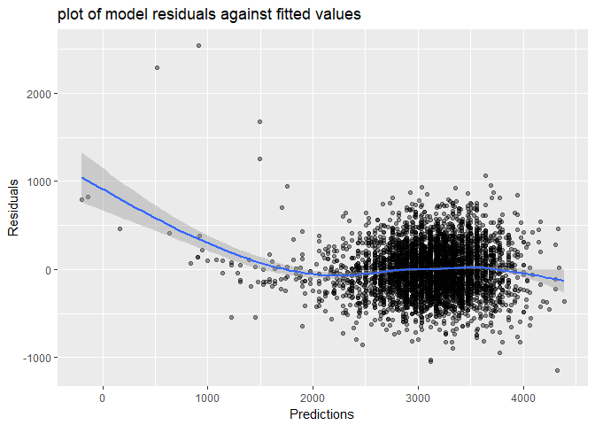

HW6
================
Chu YU
2018/11/22

Problem 1
---------

(1)The Washington Post has gathered data on homicides in 50 large U.S. cities and we will use it as our dataset.

``` r
## import the data
homicide_df = read.csv("./data/homicide-data.csv") %>%
  mutate(city_state = str_c(city,",", state),
         solving_status = 
           ifelse(disposition %in% c("Closed without arrest", "Open/No arrest"), 0, 1)) %>%
  filter(!(city_state %in% c("Dallas,TX","Phoenix,AZ","Kansas City,MO","Tulsa,AL"))) %>%
  mutate(victim_race = ifelse(victim_race == "White", "white", "non-white"),
         victim_race = factor(victim_race, levels = c("white", "non-white")),
         victim_age = as.numeric(victim_age))

str(homicide_df)
```

    ## 'data.frame':    48507 obs. of  14 variables:
    ##  $ uid           : Factor w/ 52179 levels "Alb-000001","Alb-000002",..: 1 2 3 4 5 6 7 8 9 10 ...
    ##  $ reported_date : int  20100504 20100216 20100601 20100101 20100102 20100126 20100127 20100127 20100130 20100210 ...
    ##  $ victim_last   : Factor w/ 12687 levels "AARON","AAZRI",..: 4304 8036 10274 7767 8165 1344 7075 7075 7232 5285 ...
    ##  $ victim_first  : Factor w/ 16640 levels "A'QUALE","A.C.",..: 8298 1977 16092 2068 16090 5950 3563 2758 6177 6647 ...
    ##  $ victim_race   : Factor w/ 2 levels "white","non-white": 2 2 1 2 1 1 2 2 1 2 ...
    ##  $ victim_age    : num  79 12 10 29 73 94 51 51 55 41 ...
    ##  $ victim_sex    : Factor w/ 3 levels "Female","Male",..: 2 2 1 2 1 1 2 1 2 2 ...
    ##  $ city          : Factor w/ 50 levels "Albuquerque",..: 1 1 1 1 1 1 1 1 1 1 ...
    ##  $ state         : Factor w/ 28 levels "AL","AZ","CA",..: 19 19 19 19 19 19 19 19 19 19 ...
    ##  $ lat           : num  35.1 35.1 35.1 35.1 35.1 ...
    ##  $ lon           : num  -107 -107 -107 -107 -107 ...
    ##  $ disposition   : Factor w/ 3 levels "Closed by arrest",..: 2 1 2 1 2 3 1 1 3 3 ...
    ##  $ city_state    : chr  "Albuquerque,NM" "Albuquerque,NM" "Albuquerque,NM" "Albuquerque,NM" ...
    ##  $ solving_status: num  0 1 0 1 0 0 1 1 0 0 ...

(2)linear regression model For the city of Baltimore, MD

``` r
homicide_fit_logistic = homicide_df %>%
  filter(city_state == "Baltimore,MD") %>% 
  glm(solving_status ~ victim_age + victim_race + victim_sex, 
      family = binomial(), data = .)
 
homi_or = homicide_fit_logistic %>% 
  broom::tidy() %>% 
  mutate(OR = exp(estimate)) %>%
  select(term, OR)

homi_confidt = homicide_fit_logistic %>% 
  broom::confint_tidy() %>% 
    mutate(conf.low = exp(conf.low),
           conf.high = exp(conf.high))

cbind(homi_or, homi_confidt) %>% 
  knitr::kable(digits = 3)
```

| term                  |     OR|  conf.low|  conf.high|
|:----------------------|------:|---------:|----------:|
| (Intercept)           |  2.850|     1.835|      4.465|
| victim\_age           |  0.996|     0.990|      1.002|
| victim\_racenon-white |  0.453|     0.321|      0.636|
| victim\_sexMale       |  0.413|     0.316|      0.539|

(3)For each of the cities

``` r
or_confidt = function(homicide_data){
    fit_logistic = glm(solving_status ~ victim_age + victim_sex + victim_race, data = homicide_data, family = binomial())
    
    oddsr = fit_logistic %>% 
    broom::tidy() %>% 
    mutate(or = exp(estimate)) %>%
    select(term, or)
    
    confidt = fit_logistic %>% 
    broom::confint_tidy() %>% 
    mutate(conf.low = exp(conf.low),
           conf.high = exp(conf.high))
    
    output = cbind(oddsr, confidt) %>% 
      filter(term == "victim_racenon-white") %>% select(-term)
    
    output}


homicide_cities = homicide_df %>%
  group_by(city_state) %>%
  nest() %>%
  mutate(estimation = map(data, or_confidt)) %>%
  select(city_state, estimation) %>% unnest() 
```

1.  Create a plot that shows the estimated ORs and CIs for each city.

``` r
homicide_cities %>%
  ggplot(aes(y = or,x = reorder(city_state, or))) + 
  geom_point() +
  geom_errorbar(aes(x = city_state, ymin = conf.low, ymax = conf.high)) +
  labs(
    title = "scatterplot of ORs and CIs for each city",
    x = "city and state name",
    y = "Solving status "
  ) +
   theme(axis.text.x = element_text(angle = 60, hjust = 1))
```


problem 2
---------

``` r
## import the data and clean it
birthweight = read.csv("./data/birthweight.csv") %>%
  mutate(babysex = as.factor(babysex), 
         frace = as.factor(frace), 
         malform = as.factor(malform),
         mrace = as.factor(mrace))

## check for the missing values
sum(is.na(birthweight))
```

    ## [1] 0

(1)Propose a regression model for birthweight.

``` r
##using stepwise to  
mult.fit = lm(bwt ~ ., data = birthweight)
step(mult.fit, direction = 'backward')
```

    ## Start:  AIC=48717.83
    ## bwt ~ babysex + bhead + blength + delwt + fincome + frace + gaweeks + 
    ##     malform + menarche + mheight + momage + mrace + parity + 
    ##     pnumlbw + pnumsga + ppbmi + ppwt + smoken + wtgain
    ## 
    ## 
    ## Step:  AIC=48717.83
    ## bwt ~ babysex + bhead + blength + delwt + fincome + frace + gaweeks + 
    ##     malform + menarche + mheight + momage + mrace + parity + 
    ##     pnumlbw + pnumsga + ppbmi + ppwt + smoken
    ## 
    ## 
    ## Step:  AIC=48717.83
    ## bwt ~ babysex + bhead + blength + delwt + fincome + frace + gaweeks + 
    ##     malform + menarche + mheight + momage + mrace + parity + 
    ##     pnumlbw + ppbmi + ppwt + smoken
    ## 
    ## 
    ## Step:  AIC=48717.83
    ## bwt ~ babysex + bhead + blength + delwt + fincome + frace + gaweeks + 
    ##     malform + menarche + mheight + momage + mrace + parity + 
    ##     ppbmi + ppwt + smoken
    ## 
    ##            Df Sum of Sq       RSS   AIC
    ## - frace     4    124365 320848704 48712
    ## - malform   1      1419 320725757 48716
    ## - ppbmi     1      6346 320730684 48716
    ## - momage    1     28661 320752999 48716
    ## - mheight   1     66886 320791224 48717
    ## - menarche  1    111679 320836018 48717
    ## - ppwt      1    131132 320855470 48718
    ## <none>                  320724338 48718
    ## - fincome   1    193454 320917792 48718
    ## - parity    1    413584 321137922 48721
    ## - mrace     3    868321 321592659 48724
    ## - babysex   1    853796 321578134 48727
    ## - gaweeks   1   4611823 325336161 48778
    ## - smoken    1   5076393 325800732 48784
    ## - delwt     1   8008891 328733230 48823
    ## - blength   1 102050296 422774634 49915
    ## - bhead     1 106535716 427260054 49961
    ## 
    ## Step:  AIC=48711.51
    ## bwt ~ babysex + bhead + blength + delwt + fincome + gaweeks + 
    ##     malform + menarche + mheight + momage + mrace + parity + 
    ##     ppbmi + ppwt + smoken
    ## 
    ##            Df Sum of Sq       RSS   AIC
    ## - malform   1      1447 320850151 48710
    ## - ppbmi     1      6975 320855679 48710
    ## - momage    1     28379 320877083 48710
    ## - mheight   1     69502 320918206 48710
    ## - menarche  1    115708 320964411 48711
    ## - ppwt      1    133961 320982665 48711
    ## <none>                  320848704 48712
    ## - fincome   1    194405 321043108 48712
    ## - parity    1    414687 321263390 48715
    ## - babysex   1    852133 321700837 48721
    ## - gaweeks   1   4625208 325473911 48772
    ## - smoken    1   5036389 325885093 48777
    ## - delwt     1   8013099 328861802 48817
    ## - mrace     3  13540415 334389119 48885
    ## - blength   1 101995688 422844392 49908
    ## - bhead     1 106662962 427511666 49956
    ## 
    ## Step:  AIC=48709.53
    ## bwt ~ babysex + bhead + blength + delwt + fincome + gaweeks + 
    ##     menarche + mheight + momage + mrace + parity + ppbmi + ppwt + 
    ##     smoken
    ## 
    ##            Df Sum of Sq       RSS   AIC
    ## - ppbmi     1      6928 320857079 48708
    ## - momage    1     28660 320878811 48708
    ## - mheight   1     69320 320919470 48708
    ## - menarche  1    116027 320966177 48709
    ## - ppwt      1    133894 320984044 48709
    ## <none>                  320850151 48710
    ## - fincome   1    193784 321043934 48710
    ## - parity    1    414482 321264633 48713
    ## - babysex   1    851279 321701430 48719
    ## - gaweeks   1   4624003 325474154 48770
    ## - smoken    1   5035195 325885346 48775
    ## - delwt     1   8029079 328879230 48815
    ## - mrace     3  13553320 334403471 48883
    ## - blength   1 102009225 422859375 49906
    ## - bhead     1 106675331 427525481 49954
    ## 
    ## Step:  AIC=48707.63
    ## bwt ~ babysex + bhead + blength + delwt + fincome + gaweeks + 
    ##     menarche + mheight + momage + mrace + parity + ppwt + smoken
    ## 
    ##            Df Sum of Sq       RSS   AIC
    ## - momage    1     29211 320886290 48706
    ## - menarche  1    117635 320974714 48707
    ## <none>                  320857079 48708
    ## - fincome   1    195199 321052278 48708
    ## - parity    1    412984 321270064 48711
    ## - babysex   1    850020 321707099 48717
    ## - mheight   1   1078673 321935752 48720
    ## - ppwt      1   2934023 323791103 48745
    ## - gaweeks   1   4621504 325478583 48768
    ## - smoken    1   5039368 325896447 48773
    ## - delwt     1   8024939 328882018 48813
    ## - mrace     3  13551444 334408523 48881
    ## - blength   1 102018559 422875638 49904
    ## - bhead     1 106821342 427678421 49953
    ## 
    ## Step:  AIC=48706.02
    ## bwt ~ babysex + bhead + blength + delwt + fincome + gaweeks + 
    ##     menarche + mheight + mrace + parity + ppwt + smoken
    ## 
    ##            Df Sum of Sq       RSS   AIC
    ## - menarche  1    100121 320986412 48705
    ## <none>                  320886290 48706
    ## - fincome   1    240800 321127090 48707
    ## - parity    1    431433 321317724 48710
    ## - babysex   1    841278 321727568 48715
    ## - mheight   1   1076739 321963029 48719
    ## - ppwt      1   2913653 323799943 48743
    ## - gaweeks   1   4676469 325562760 48767
    ## - smoken    1   5045104 325931394 48772
    ## - delwt     1   8000672 328886962 48811
    ## - mrace     3  14667730 335554021 48894
    ## - blength   1 101990556 422876847 49902
    ## - bhead     1 106864308 427750598 49952
    ## 
    ## Step:  AIC=48705.38
    ## bwt ~ babysex + bhead + blength + delwt + fincome + gaweeks + 
    ##     mheight + mrace + parity + ppwt + smoken
    ## 
    ##           Df Sum of Sq       RSS   AIC
    ## <none>                 320986412 48705
    ## - fincome  1    245637 321232048 48707
    ## - parity   1    422770 321409181 48709
    ## - babysex  1    846134 321832545 48715
    ## - mheight  1   1012240 321998651 48717
    ## - ppwt     1   2907049 323893461 48743
    ## - gaweeks  1   4662501 325648912 48766
    ## - smoken   1   5073849 326060260 48771
    ## - delwt    1   8137459 329123871 48812
    ## - mrace    3  14683609 335670021 48894
    ## - blength  1 102191779 423178191 49903
    ## - bhead    1 106779754 427766166 49950

    ## 
    ## Call:
    ## lm(formula = bwt ~ babysex + bhead + blength + delwt + fincome + 
    ##     gaweeks + mheight + mrace + parity + ppwt + smoken, data = birthweight)
    ## 
    ## Coefficients:
    ## (Intercept)     babysex2        bhead      blength        delwt  
    ##   -6098.822       28.558      130.777       74.947        4.107  
    ##     fincome      gaweeks      mheight       mrace2       mrace3  
    ##       0.318       11.592        6.594     -138.792      -74.887  
    ##      mrace4       parity         ppwt       smoken  
    ##    -100.678       96.305       -2.676       -4.843

By using the "stepwise regression", I finally choose "bhead", "blength", "mrace", "parity" as the predictors.

``` r
bwt_fit = lm(bwt ~ bhead + blength + mrace + parity, data = birthweight)

summary(bwt_fit)
```

    ## 
    ## Call:
    ## lm(formula = bwt ~ bhead + blength + mrace + parity, data = birthweight)
    ## 
    ## Residuals:
    ##      Min       1Q   Median       3Q      Max 
    ## -1146.10  -187.02    -7.27   179.03  2543.20 
    ## 
    ## Coefficients:
    ##              Estimate Std. Error t value Pr(>|t|)    
    ## (Intercept) -5673.145     96.997 -58.488  < 2e-16 ***
    ## bhead         141.127      3.431  41.130  < 2e-16 ***
    ## blength        82.475      2.036  40.510  < 2e-16 ***
    ## mrace2       -129.019      9.108 -14.166  < 2e-16 ***
    ## mrace3        -97.485     43.481  -2.242   0.0250 *  
    ## mrace4       -128.133     19.144  -6.693 2.47e-11 ***
    ## parity         79.263     41.656   1.903   0.0571 .  
    ## ---
    ## Signif. codes:  0 '***' 0.001 '**' 0.01 '*' 0.05 '.' 0.1 ' ' 1
    ## 
    ## Residual standard error: 282.3 on 4335 degrees of freedom
    ## Multiple R-squared:  0.6966, Adjusted R-squared:  0.6962 
    ## F-statistic:  1659 on 6 and 4335 DF,  p-value: < 2.2e-16

We then get the bwt\_fit model: bwt ~ bhead + blength + mrace + parity. And from the further analysis of it, we can get adjustedd R-squared 0.6962.

``` r
bwt_pre_res = birthweight %>% 
    add_predictions(model = bwt_fit, var = "pred") %>% 
    add_residuals(model = bwt_fit, var = "resid")

bwt_pre_res %>% 
    ggplot(aes(x = pred, y = resid)) +
    geom_point(alpha = 0.4) +
    geom_smooth() +
    labs(
        y = "Residuals",
        x = "Predictions",
        title = "plot of model residuals against fitted values"
    )
```



1.  Compare your model to two others

``` r
## using cv to compare three different lm models
cv_df =
  crossv_mc(birthweight, 100) %>% 
  mutate(train = map(train, as_tibble),
         test = map(test, as_tibble)) %>%
  mutate(bwt_myfit1 = map(train, ~lm(bwt ~ bhead + blength + mrace + parity, data = .x)),
         bwt_fit_compare1 = map(train, ~lm(bwt ~ gaweeks + blength , data = .x)),
         bwt_fit_compare2 = map(train, ~lm(bwt ~ bhead + blength + babysex +babysex * blength + babysex * bhead + bhead * babysex + bhead * babysex * blength, data = .x))) %>% 
  mutate(rmse_lin    = map2_dbl(bwt_myfit1, test, ~rmse(model = .x, data = .y)),
         rmse_pwl = map2_dbl(bwt_fit_compare1, test, ~rmse(model = .x, data = .y)),
         rmse_nonlin = map2_dbl(bwt_fit_compare2, test, ~rmse(model = .x, data = .y)))
```

a plot for comoparing

``` r
cv_df %>% 
  select(starts_with("rmse")) %>% 
  gather(key = model, value = rmse) %>% 
  mutate(model = str_replace(model, "rmse_", ""),
         model = fct_inorder(model)) %>% 
  ggplot(aes(x = model, y = rmse)) + geom_violin()
```


