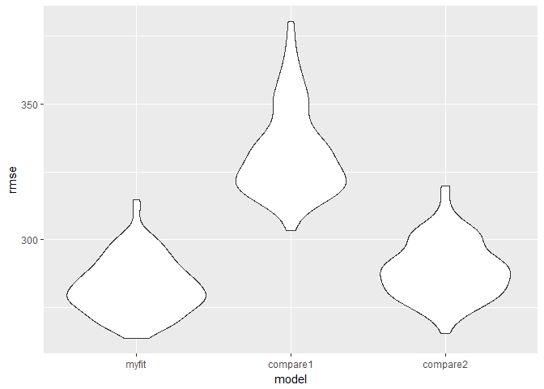

HW6
================
Chu YU
2018/11/22

Problem 1
---------

(1)The Washington Post has gathered data on homicides in 50 large U.S. cities and we will use it as our dataset.

``` r
## import the data
homicide_df = read.csv("./data/homicide-data.csv") %>%
  mutate(city_state = str_c(city,",", state),
         solving_status = 
           ifelse(disposition %in% c("Closed without arrest", "Open/No arrest"), 0, 1)) %>%
  filter(!(city_state %in% c("Dallas,TX","Phoenix,AZ","Kansas City,MO","Tulsa,AL"))) %>%
  mutate(victim_race = ifelse(victim_race == "White", "white", "non-white"),
         victim_race = factor(victim_race, levels = c("white", "non-white")),
         victim_age = as.numeric(victim_age))

str(homicide_df)
```

    ## 'data.frame':    48507 obs. of  14 variables:
    ##  $ uid           : Factor w/ 52179 levels "Alb-000001","Alb-000002",..: 1 2 3 4 5 6 7 8 9 10 ...
    ##  $ reported_date : int  20100504 20100216 20100601 20100101 20100102 20100126 20100127 20100127 20100130 20100210 ...
    ##  $ victim_last   : Factor w/ 12687 levels "AARON","AAZRI",..: 4304 8036 10274 7767 8165 1344 7075 7075 7232 5285 ...
    ##  $ victim_first  : Factor w/ 16640 levels "A'QUALE","A.C.",..: 8298 1977 16092 2068 16090 5950 3563 2758 6177 6647 ...
    ##  $ victim_race   : Factor w/ 2 levels "white","non-white": 2 2 1 2 1 1 2 2 1 2 ...
    ##  $ victim_age    : num  79 12 10 29 73 94 51 51 55 41 ...
    ##  $ victim_sex    : Factor w/ 3 levels "Female","Male",..: 2 2 1 2 1 1 2 1 2 2 ...
    ##  $ city          : Factor w/ 50 levels "Albuquerque",..: 1 1 1 1 1 1 1 1 1 1 ...
    ##  $ state         : Factor w/ 28 levels "AL","AZ","CA",..: 19 19 19 19 19 19 19 19 19 19 ...
    ##  $ lat           : num  35.1 35.1 35.1 35.1 35.1 ...
    ##  $ lon           : num  -107 -107 -107 -107 -107 ...
    ##  $ disposition   : Factor w/ 3 levels "Closed by arrest",..: 2 1 2 1 2 3 1 1 3 3 ...
    ##  $ city_state    : chr  "Albuquerque,NM" "Albuquerque,NM" "Albuquerque,NM" "Albuquerque,NM" ...
    ##  $ solving_status: num  0 1 0 1 0 0 1 1 0 0 ...

**intoduction of the dataset :**

The Washington Post has identified the places in dozens of American cities where murder is common but arrests are rare. These pockets of impunity were identified by obtaining and analyzing up to a decade of homicide arrest data from 50 of the nation’s largest cities. The analysis of 52,000 criminal homicides goes beyond what is known nationally about the unsolved cases, revealing block by block where police fail to catch killers.

**The data frame:**

The dataset "homicide\_df" has 14 variables and 48507 observations, including the date and location of the crimes, the victims' personal information, and the deposition results.

After importing the dataset of homicides, I firstly used `mutate` to add a new variable representing the city and state of the data and another one to represent the status of the crimes. Then I deleted some useless rows and changed the variables "victim\_race", "victim\_age" into factors.

(2)linear regression model For the city of Baltimore, MD

``` r
homicide_fit_logistic = homicide_df %>%
  filter(city_state == "Baltimore,MD") %>% 
  glm(solving_status ~ victim_age + victim_race + victim_sex, 
      family = binomial(), data = .)
 
homi_or = homicide_fit_logistic %>% 
  broom::tidy() %>% 
  mutate(OR = exp(estimate)) %>%
  select(term, OR)

homi_confidt = homicide_fit_logistic %>% 
  broom::confint_tidy() %>% 
    mutate(conf.low = exp(conf.low),
           conf.high = exp(conf.high))

cbind(homi_or, homi_confidt) %>% 
  knitr::kable(digits = 3)
```

| term                  |     OR|  conf.low|  conf.high|
|:----------------------|------:|---------:|----------:|
| (Intercept)           |  2.850|     1.835|      4.465|
| victim\_age           |  0.996|     0.990|      1.002|
| victim\_racenon-white |  0.453|     0.321|      0.636|
| victim\_sexMale       |  0.413|     0.316|      0.539|

As is required,For the city of Baltimore, MD, I used the glm function to fit a logistic regression with resolved vs unresolved as the outcome and victim age, sex and race as predictors.

By using `glm`, `broom::tidy`, `broom::confint_tidy`, I got a table about the odds ratios and confident intervals of the victims' age, race and sex in Baltimore, MD.

(3)For each of the cities

``` r
or_confidt = function(homicide_data){
    fit_logistic = glm(solving_status ~ victim_age + victim_sex + victim_race, data = homicide_data, family = binomial())
    
    oddsr = fit_logistic %>% 
    broom::tidy() %>% 
    mutate(or = exp(estimate)) %>%
    select(term, or)
    
    confidt = fit_logistic %>% 
    broom::confint_tidy() %>% 
    mutate(conf.low = exp(conf.low),
           conf.high = exp(conf.high))
    
    output = cbind(oddsr, confidt) %>% 
      filter(term == "victim_racenon-white") %>% select(-term)
    
    output}


homicide_cities = homicide_df %>%
  group_by(city_state) %>%
  nest() %>%
  mutate(estimation = map(data, or_confidt)) %>%
  select(city_state, estimation) %>% unnest() 
  
homicide_cities %>% knitr::kable(digits = 3)
```

| city\_state       |     or|  conf.low|  conf.high|
|:------------------|------:|---------:|----------:|
| Albuquerque,NM    |  0.686|     0.416|      1.124|
| Atlanta,GA        |  0.767|     0.433|      1.320|
| Baltimore,MD      |  0.453|     0.321|      0.636|
| Baton Rouge,LA    |  0.656|     0.299|      1.380|
| Birmingham,AL     |  1.047|     0.619|      1.759|
| Boston,MA         |  0.121|     0.045|      0.272|
| Buffalo,NY        |  0.447|     0.243|      0.811|
| Charlotte,NC      |  0.555|     0.318|      0.931|
| Chicago,IL        |  0.575|     0.442|      0.751|
| Cincinnati,OH     |  0.327|     0.186|      0.554|
| Columbus,OH       |  0.884|     0.657|      1.191|
| Denver,CO         |  0.594|     0.352|      0.998|
| Detroit,MI        |  0.661|     0.495|      0.881|
| Durham,NC         |  1.153|     0.446|      2.851|
| Fort Worth,TX     |  0.853|     0.563|      1.286|
| Fresno,CA         |  0.457|     0.228|      0.861|
| Houston,TX        |  0.921|     0.738|      1.148|
| Indianapolis,IN   |  0.516|     0.389|      0.681|
| Jacksonville,FL   |  0.681|     0.519|      0.891|
| Las Vegas,NV      |  0.788|     0.613|      1.012|
| Long Beach,CA     |  0.843|     0.404|      1.702|
| Los Angeles,CA    |  0.718|     0.523|      0.980|
| Louisville,KY     |  0.434|     0.286|      0.650|
| Memphis,TN        |  0.807|     0.536|      1.194|
| Miami,FL          |  0.577|     0.379|      0.879|
| Milwaukee,wI      |  0.660|     0.417|      1.022|
| Minneapolis,MN    |  0.667|     0.351|      1.248|
| Nashville,TN      |  0.892|     0.647|      1.225|
| New Orleans,LA    |  0.511|     0.325|      0.801|
| New York,NY       |  0.548|     0.279|      1.019|
| Oakland,CA        |  0.217|     0.101|      0.427|
| Oklahoma City,OK  |  0.711|     0.503|      1.005|
| Omaha,NE          |  0.180|     0.096|      0.317|
| Philadelphia,PA   |  0.662|     0.498|      0.873|
| Pittsburgh,PA     |  0.290|     0.162|      0.498|
| Richmond,VA       |  0.488|     0.162|      1.204|
| San Antonio,TX    |  0.698|     0.466|      1.036|
| Sacramento,CA     |  0.774|     0.442|      1.330|
| Savannah,GA       |  0.644|     0.308|      1.311|
| San Bernardino,CA |  0.946|     0.427|      2.134|
| San Diego,CA      |  0.434|     0.264|      0.699|
| San Francisco,CA  |  0.458|     0.288|      0.718|
| St. Louis,MO      |  0.601|     0.423|      0.850|
| Stockton,CA       |  0.395|     0.205|      0.747|
| Tampa,FL          |  1.185|     0.611|      2.299|
| Tulsa,OK          |  0.586|     0.400|      0.850|
| Washington,DC     |  0.527|     0.258|      1.020|

To do the plot regarding with each city in a tidy pipeline, I built a function to extract the OR and CIs of every city.And I got a table as above. There are 4 variables and 47 obs in the table, showing the adjusted ORS and CIs of each city.

(4)Create a plot that shows the estimated ORs and CIs for each city.

``` r
homicide_cities %>%
  ggplot(aes(y = or,x = reorder(city_state, or))) + 
  geom_point() +
  geom_errorbar(aes(x = city_state, ymin = conf.low, ymax = conf.high)) +
  labs(
    title = "scatterplot of ORs and CIs for each city",
    x = "city and state name",
    y = "Solving status "
  ) +
   theme(axis.text.x = element_text(angle = 60, hjust = 1))
```


From the scatterplot above, we can find that only "Tampa, FL", "Durham, NC" and "Birmingham, AL" has OR larger than 1.0, indicating that for most of the cities, the crimes whose victims are non-white may be more likely to be unsolved. Then we can see that Durham, NC gets the largest CI among all the cities, meaning the adjusted OR of solving status of this city is not stable.

problem 2
---------

``` r
## import the data and clean it
birthweight = read.csv("./data/birthweight.csv") %>%
  mutate(babysex = as.factor(babysex), 
         frace = as.factor(frace), 
         malform = as.factor(malform),
         mrace = as.factor(mrace))

## check for the missing values
sum(is.na(birthweight))
```

    ## [1] 0

After importing and cleaning the dataset, I got a dataset with 20 variables and 4342 obs.

As is required, I transferred the variables "babysex", "frace", "malform", "mrace" into factors. Then I checked the missing values of the data and found there is no missing values in it.

(1)Propose a regression model for birthweight.

``` r
##using stepwise to  
mult.fit = lm(bwt ~ ., data = birthweight)
step(mult.fit, direction = 'backward')
```

    ## Start:  AIC=48717.83
    ## bwt ~ babysex + bhead + blength + delwt + fincome + frace + gaweeks + 
    ##     malform + menarche + mheight + momage + mrace + parity + 
    ##     pnumlbw + pnumsga + ppbmi + ppwt + smoken + wtgain
    ## 
    ## 
    ## Step:  AIC=48717.83
    ## bwt ~ babysex + bhead + blength + delwt + fincome + frace + gaweeks + 
    ##     malform + menarche + mheight + momage + mrace + parity + 
    ##     pnumlbw + pnumsga + ppbmi + ppwt + smoken
    ## 
    ## 
    ## Step:  AIC=48717.83
    ## bwt ~ babysex + bhead + blength + delwt + fincome + frace + gaweeks + 
    ##     malform + menarche + mheight + momage + mrace + parity + 
    ##     pnumlbw + ppbmi + ppwt + smoken
    ## 
    ## 
    ## Step:  AIC=48717.83
    ## bwt ~ babysex + bhead + blength + delwt + fincome + frace + gaweeks + 
    ##     malform + menarche + mheight + momage + mrace + parity + 
    ##     ppbmi + ppwt + smoken
    ## 
    ##            Df Sum of Sq       RSS   AIC
    ## - frace     4    124365 320848704 48712
    ## - malform   1      1419 320725757 48716
    ## - ppbmi     1      6346 320730684 48716
    ## - momage    1     28661 320752999 48716
    ## - mheight   1     66886 320791224 48717
    ## - menarche  1    111679 320836018 48717
    ## - ppwt      1    131132 320855470 48718
    ## <none>                  320724338 48718
    ## - fincome   1    193454 320917792 48718
    ## - parity    1    413584 321137922 48721
    ## - mrace     3    868321 321592659 48724
    ## - babysex   1    853796 321578134 48727
    ## - gaweeks   1   4611823 325336161 48778
    ## - smoken    1   5076393 325800732 48784
    ## - delwt     1   8008891 328733230 48823
    ## - blength   1 102050296 422774634 49915
    ## - bhead     1 106535716 427260054 49961
    ## 
    ## Step:  AIC=48711.51
    ## bwt ~ babysex + bhead + blength + delwt + fincome + gaweeks + 
    ##     malform + menarche + mheight + momage + mrace + parity + 
    ##     ppbmi + ppwt + smoken
    ## 
    ##            Df Sum of Sq       RSS   AIC
    ## - malform   1      1447 320850151 48710
    ## - ppbmi     1      6975 320855679 48710
    ## - momage    1     28379 320877083 48710
    ## - mheight   1     69502 320918206 48710
    ## - menarche  1    115708 320964411 48711
    ## - ppwt      1    133961 320982665 48711
    ## <none>                  320848704 48712
    ## - fincome   1    194405 321043108 48712
    ## - parity    1    414687 321263390 48715
    ## - babysex   1    852133 321700837 48721
    ## - gaweeks   1   4625208 325473911 48772
    ## - smoken    1   5036389 325885093 48777
    ## - delwt     1   8013099 328861802 48817
    ## - mrace     3  13540415 334389119 48885
    ## - blength   1 101995688 422844392 49908
    ## - bhead     1 106662962 427511666 49956
    ## 
    ## Step:  AIC=48709.53
    ## bwt ~ babysex + bhead + blength + delwt + fincome + gaweeks + 
    ##     menarche + mheight + momage + mrace + parity + ppbmi + ppwt + 
    ##     smoken
    ## 
    ##            Df Sum of Sq       RSS   AIC
    ## - ppbmi     1      6928 320857079 48708
    ## - momage    1     28660 320878811 48708
    ## - mheight   1     69320 320919470 48708
    ## - menarche  1    116027 320966177 48709
    ## - ppwt      1    133894 320984044 48709
    ## <none>                  320850151 48710
    ## - fincome   1    193784 321043934 48710
    ## - parity    1    414482 321264633 48713
    ## - babysex   1    851279 321701430 48719
    ## - gaweeks   1   4624003 325474154 48770
    ## - smoken    1   5035195 325885346 48775
    ## - delwt     1   8029079 328879230 48815
    ## - mrace     3  13553320 334403471 48883
    ## - blength   1 102009225 422859375 49906
    ## - bhead     1 106675331 427525481 49954
    ## 
    ## Step:  AIC=48707.63
    ## bwt ~ babysex + bhead + blength + delwt + fincome + gaweeks + 
    ##     menarche + mheight + momage + mrace + parity + ppwt + smoken
    ## 
    ##            Df Sum of Sq       RSS   AIC
    ## - momage    1     29211 320886290 48706
    ## - menarche  1    117635 320974714 48707
    ## <none>                  320857079 48708
    ## - fincome   1    195199 321052278 48708
    ## - parity    1    412984 321270064 48711
    ## - babysex   1    850020 321707099 48717
    ## - mheight   1   1078673 321935752 48720
    ## - ppwt      1   2934023 323791103 48745
    ## - gaweeks   1   4621504 325478583 48768
    ## - smoken    1   5039368 325896447 48773
    ## - delwt     1   8024939 328882018 48813
    ## - mrace     3  13551444 334408523 48881
    ## - blength   1 102018559 422875638 49904
    ## - bhead     1 106821342 427678421 49953
    ## 
    ## Step:  AIC=48706.02
    ## bwt ~ babysex + bhead + blength + delwt + fincome + gaweeks + 
    ##     menarche + mheight + mrace + parity + ppwt + smoken
    ## 
    ##            Df Sum of Sq       RSS   AIC
    ## - menarche  1    100121 320986412 48705
    ## <none>                  320886290 48706
    ## - fincome   1    240800 321127090 48707
    ## - parity    1    431433 321317724 48710
    ## - babysex   1    841278 321727568 48715
    ## - mheight   1   1076739 321963029 48719
    ## - ppwt      1   2913653 323799943 48743
    ## - gaweeks   1   4676469 325562760 48767
    ## - smoken    1   5045104 325931394 48772
    ## - delwt     1   8000672 328886962 48811
    ## - mrace     3  14667730 335554021 48894
    ## - blength   1 101990556 422876847 49902
    ## - bhead     1 106864308 427750598 49952
    ## 
    ## Step:  AIC=48705.38
    ## bwt ~ babysex + bhead + blength + delwt + fincome + gaweeks + 
    ##     mheight + mrace + parity + ppwt + smoken
    ## 
    ##           Df Sum of Sq       RSS   AIC
    ## <none>                 320986412 48705
    ## - fincome  1    245637 321232048 48707
    ## - parity   1    422770 321409181 48709
    ## - babysex  1    846134 321832545 48715
    ## - mheight  1   1012240 321998651 48717
    ## - ppwt     1   2907049 323893461 48743
    ## - gaweeks  1   4662501 325648912 48766
    ## - smoken   1   5073849 326060260 48771
    ## - delwt    1   8137459 329123871 48812
    ## - mrace    3  14683609 335670021 48894
    ## - blength  1 102191779 423178191 49903
    ## - bhead    1 106779754 427766166 49950

    ## 
    ## Call:
    ## lm(formula = bwt ~ babysex + bhead + blength + delwt + fincome + 
    ##     gaweeks + mheight + mrace + parity + ppwt + smoken, data = birthweight)
    ## 
    ## Coefficients:
    ## (Intercept)     babysex2        bhead      blength        delwt  
    ##   -6098.822       28.558      130.777       74.947        4.107  
    ##     fincome      gaweeks      mheight       mrace2       mrace3  
    ##       0.318       11.592        6.594     -138.792      -74.887  
    ##      mrace4       parity         ppwt       smoken  
    ##    -100.678       96.305       -2.676       -4.843

By using the "stepwise regression", I finally choose "bhead", "blength", "mrace", "parity" as the predictors, which I think have higher association with babyweight.

``` r
bwt_fit = lm(bwt ~ bhead + blength + mrace + parity, data = birthweight)

summary(bwt_fit)
```

    ## 
    ## Call:
    ## lm(formula = bwt ~ bhead + blength + mrace + parity, data = birthweight)
    ## 
    ## Residuals:
    ##      Min       1Q   Median       3Q      Max 
    ## -1146.10  -187.02    -7.27   179.03  2543.20 
    ## 
    ## Coefficients:
    ##              Estimate Std. Error t value Pr(>|t|)    
    ## (Intercept) -5673.145     96.997 -58.488  < 2e-16 ***
    ## bhead         141.127      3.431  41.130  < 2e-16 ***
    ## blength        82.475      2.036  40.510  < 2e-16 ***
    ## mrace2       -129.019      9.108 -14.166  < 2e-16 ***
    ## mrace3        -97.485     43.481  -2.242   0.0250 *  
    ## mrace4       -128.133     19.144  -6.693 2.47e-11 ***
    ## parity         79.263     41.656   1.903   0.0571 .  
    ## ---
    ## Signif. codes:  0 '***' 0.001 '**' 0.01 '*' 0.05 '.' 0.1 ' ' 1
    ## 
    ## Residual standard error: 282.3 on 4335 degrees of freedom
    ## Multiple R-squared:  0.6966, Adjusted R-squared:  0.6962 
    ## F-statistic:  1659 on 6 and 4335 DF,  p-value: < 2.2e-16

We then get the bwt\_fit model: bwt ~ bhead + blength + mrace + parity. And from the further analysis of it, we can get adjustedd R-squared 0.6962, according to which I think I choose the right variables.

``` r
bwt_pre_res = birthweight %>% 
    add_predictions(model = bwt_fit, var = "pred") %>% 
    add_residuals(model = bwt_fit, var = "resid")

bwt_pre_res %>% 
    ggplot(aes(x = pred, y = resid)) +
    geom_point(alpha = 0.4) +
    geom_smooth() +
    labs(
        y = "Residuals",
        x = "Predictions",
        title = "plot of model residuals against fitted values"
    )
```


By using "add\_predictions" and "add\_residuals" I got a scatterplot with smooth line as above.

We can see from the plot that when predictions are approximately from 2000 to 4000, the residuals are near zero, indicating that further the predictions are away from this interval, less likely are the residuals normal. So this model is most valid in this interval.

(3)Compare your model to two others

``` r
## using cv to compare three different lm models
cv_df =
  crossv_mc(birthweight, 100) %>% 
  mutate(train = map(train, as_tibble),
         test = map(test, as_tibble)) %>%
  mutate(bwt_myfit1 = map(train, ~lm(bwt ~ bhead + blength + mrace + parity, data = .x)),
         bwt_fit_compare1 = map(train, ~lm(bwt ~ gaweeks + blength , data = .x)),
         bwt_fit_compare2 = map(train, ~lm(bwt ~ bhead + blength + babysex +babysex * blength + babysex * bhead + bhead * babysex + bhead * babysex * blength, data = .x))) %>% 
  mutate(rmse_myfit  = map2_dbl(bwt_myfit1, test, ~rmse(model = .x, data = .y)),
         rmse_compare1 = map2_dbl(bwt_fit_compare1, test, ~rmse(model = .x, data = .y)),
         rmse_compare2 = map2_dbl(bwt_fit_compare2, test, ~rmse(model = .x, data = .y)))
```

I built a CV data set to compare the three different linear regression models.

(4)a plot for comoparing

``` r
cv_df %>% 
  select(starts_with("rmse")) %>% 
  gather(key = model, value = rmse) %>% 
  mutate(model = str_replace(model, "rmse_", ""),
         model = fct_inorder(model)) %>% 
  ggplot(aes(x = model, y = rmse)) + geom_violin()
```



I got three different models as below:

-   bwt\_myfit1 : bwt ~ bhead + blength + mrace + parity;

-   bwt\_fit\_compare1 : bwt ~ gaweeks + blength;

-   bwt\_fit\_compare2 : bwt ~ bhead + blength + babysex +babysex \* blength + babysex \* bhead + bhead \* babysex + bhead \* babysex \* blength

From the violin plot, we can see that the second model has the significantly highest RMSE among three models, and my model has the lowest RMSE. So I can conclude that my model: bwt ~ bhead + blength + mrace + parity is better than the other two models and the second model is the worst.
